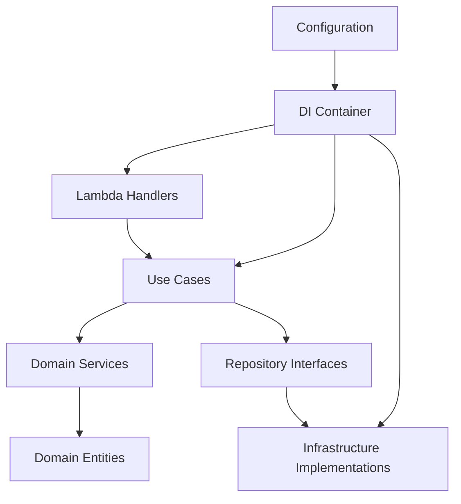

# Enterprise Refactoring Design Document

## Overview

This design transforms the current Lambda-based application from a tightly-coupled AWS-specific architecture to a cloud-agnostic, enterprise-level system using clean architecture principles and dependency injection. The refactoring builds upon the existing foundation (IStorageService, aws_storage.py, mock_storage.py) to create a comprehensive abstraction layer that supports multiple cloud providers and deployment patterns.

### Current State Analysis

The existing application consists of:
- 9 Lambda functions with direct AWS service dependencies (boto3 clients)
- Flat services folder with mixed concerns (logging_config.py, aws_storage.py, mock_storage.py)
- Direct imports of AWS services in Lambda handlers
- Hardcoded service instantiation throughout the codebase

### Target State Vision

The refactored application will feature:
- Clean architecture with clear layer separation
- Dependency injection container managing all service lifecycles
- Cloud-agnostic interfaces with pluggable implementations
- Enterprise-level folder structure following domain-driven design
- Support for multiple deployment patterns (Lambda, containers, traditional servers)

## Architecture

### Clean Architecture Layers

```
src/
├── domain/                     # Enterprise Business Rules
│   ├── entities/              # Core business entities
│   ├── value_objects/         # Domain value objects
│   └── services/              # Domain services (business logic)
├── application/               # Application Business Rules
│   ├── use_cases/            # Application-specific business rules
│   ├── interfaces/           # Abstract interfaces for external concerns
│   └── dto/                  # Data transfer objects
├── infrastructure/           # Frameworks & Drivers
│   ├── persistence/          # Database implementations
│   ├── messaging/            # Message queue implementations
│   ├── external_services/    # Third-party service adapters
│   ├── logging/              # Logging implementations
│   └── config/               # Configuration management
├── presentation/             # Interface Adapters
│   ├── lambda_handlers/      # AWS Lambda entry points
│   ├── http_controllers/     # HTTP API controllers
│   └── websocket_handlers/   # WebSocket connection handlers
└── shared/                   # Shared utilities
    ├── dependency_injection/ # DI container and configuration
    ├── exceptions/           # Custom exception types
    └── utils/                # Common utilities
```

### Dependency Flow



## Components and Interfaces

### Core Abstractions

#### 1. Storage Abstraction (Building on existing IStorageService)

```python
# application/interfaces/repositories.py
from abc import ABC, abstractmethod
from typing import Dict, Any, Optional, List
from domain.entities import SearchResult, ConnectionSession

class ISearchResultRepository(ABC):
    @abstractmethod
    async def save_result(self, result: SearchResult) -> str:
        """Save search result and return share token"""
        pass
    
    @abstractmethod
    async def get_result_by_share_token(self, share_token: str) -> Optional[SearchResult]:
        pass

class IConnectionRepository(ABC):
    @abstractmethod
    async def save_connection(self, session: ConnectionSession) -> str:
        pass
    
    @abstractmethod
    async def get_connection(self, connection_id: str) -> Optional[ConnectionSession]:
        pass
```

#### 2. Messaging Abstraction

```python
# application/interfaces/messaging.py
from abc import ABC, abstractmethod
from typing import Dict, Any

class IMessageQueue(ABC):
    @abstractmethod
    async def send_message(self, queue_name: str, message: Dict[str, Any]) -> bool:
        pass
    
    @abstractmethod
    async def receive_messages(self, queue_name: str, max_messages: int = 10) -> List[Dict[str, Any]]:
        pass

class IWorkflowOrchestrator(ABC):
    @abstractmethod
    async def start_workflow(self, workflow_name: str, input_data: Dict[str, Any]) -> str:
        """Start workflow and return execution ID"""
        pass
```

#### 3. WebSocket Connection Management

```python
# application/interfaces/connections.py
from abc import ABC, abstractmethod
from typing import Dict, Any

class IConnectionManager(ABC):
    @abstractmethod
    async def send_to_connection(self, connection_id: str, message: Dict[str, Any]) -> bool:
        pass
    
    @abstractmethod
    async def disconnect_connection(self, connection_id: str) -> bool:
        pass
```

#### 4. External Provider Abstraction

```python
# application/interfaces/providers.py
from abc import ABC, abstractmethod
from typing import List
from domain.entities import ProviderOffer, Address

class IProviderService(ABC):
    @abstractmethod
    async def get_offers(self, address: Address) -> List[ProviderOffer]:
        pass
    
    @property
    @abstractmethod
    def provider_name(self) -> str:
        pass
```

#### 5. Logging Abstraction

```python
# application/interfaces/logging.py
from abc import ABC, abstractmethod
from typing import Dict, Any, Optional

class ILogger(ABC):
    @abstractmethod
    def info(self, message: str, context: Optional[Dict[str, Any]] = None) -> None:
        pass
    
    @abstractmethod
    def error(self, message: str, context: Optional[Dict[str, Any]] = None) -> None:
        pass
    
    @abstractmethod
    def debug(self, message: str, context: Optional[Dict[str, Any]] = None) -> None:
        pass

class ILoggerFactory(ABC):
    @abstractmethod
    def create_logger(self, name: str) -> ILogger:
        pass
```

### Domain Entities

```python
# domain/entities/search_result.py
from dataclasses import dataclass
from typing import List, Dict, Any
from datetime import datetime

@dataclass
class Address:
    street: str
    house_number: str
    city: str
    postal_code: str

@dataclass
class ProviderOffer:
    provider_name: str
    product_id: str
    speed_mbps: int
    monthly_cost_euros: float
    connection_type: str
    # ... other fields

@dataclass
class SearchResult:
    request_id: str
    share_token: str
    address: Address
    offers: List[ProviderOffer]
    timestamp: datetime
    expires_at: datetime
```

### Use Cases

```python
# application/use_cases/search_offers.py
from application.interfaces.repositories import ISearchResultRepository
from application.interfaces.providers import IProviderService
from application.interfaces.messaging import IMessageQueue
from domain.entities import Address, SearchResult
from typing import List

class SearchOffersUseCase:
    def __init__(
        self,
        result_repository: ISearchResultRepository,
        provider_services: List[IProviderService],
        message_queue: IMessageQueue
    ):
        self._result_repository = result_repository
        self._provider_services = provider_services
        self._message_queue = message_queue
    
    async def execute(self, address: Address, connection_id: str) -> str:
        """Execute search and return request ID"""
        # Business logic here
        pass
```

## Data Models

### Configuration Models

```python
# shared/config/models.py
from dataclasses import dataclass
from typing import Dict, Any, Optional

@dataclass
class DatabaseConfig:
    provider: str  # 'aws_dynamodb', 'azure_cosmos', 'mock'
    connection_string: Optional[str] = None
    table_prefix: str = ""
    region: Optional[str] = None

@dataclass
class MessagingConfig:
    provider: str  # 'aws_sqs', 'azure_servicebus', 'mock'
    connection_string: Optional[str] = None
    queue_prefix: str = ""

@dataclass
class LoggingConfig:
    provider: str  # 'aws_cloudwatch', 'azure_monitor', 'console'
    level: str = "INFO"
    structured: bool = True

@dataclass
class AppConfig:
    environment: str
    database: DatabaseConfig
    messaging: MessagingConfig
    logging: LoggingConfig
    provider_configs: Dict[str, Any]
```

## Error Handling

### Custom Exception Hierarchy

```python
# shared/exceptions/base.py
class DomainException(Exception):
    """Base exception for domain-related errors"""
    pass

class InfrastructureException(Exception):
    """Base exception for infrastructure-related errors"""
    pass

class ConfigurationException(Exception):
    """Configuration-related errors"""
    pass

# shared/exceptions/domain.py
class InvalidAddressException(DomainException):
    pass

class ProviderUnavailableException(DomainException):
    pass

# shared/exceptions/infrastructure.py
class DatabaseConnectionException(InfrastructureException):
    pass

class MessageQueueException(InfrastructureException):
    pass
```

### Error Handling Strategy

```python
# application/use_cases/base.py
from shared.exceptions import DomainException, InfrastructureException
from application.interfaces.logging import ILogger

class BaseUseCase:
    def __init__(self, logger: ILogger):
        self._logger = logger
    
    async def _handle_error(self, error: Exception, context: Dict[str, Any]) -> None:
        if isinstance(error, DomainException):
            self._logger.info(f"Domain error: {str(error)}", context)
        elif isinstance(error, InfrastructureException):
            self._logger.error(f"Infrastructure error: {str(error)}", context)
        else:
            self._logger.error(f"Unexpected error: {str(error)}", context)
```

## Testing Strategy

### Test Architecture

```
tests/
├── unit/                     # Unit tests for individual components
│   ├── domain/              # Domain entity and service tests
│   ├── application/         # Use case tests
│   └── infrastructure/      # Infrastructure adapter tests
├── integration/             # Integration tests
│   ├── repositories/        # Repository integration tests
│   └── external_services/   # External service integration tests
├── e2e/                     # End-to-end tests
│   └── lambda_handlers/     # Full Lambda handler tests
└── fixtures/                # Test data and mocks
    ├── mock_implementations/ # Mock service implementations
    └── test_data/           # Sample data for tests
```

### Mock Implementations

```python
# tests/fixtures/mock_implementations/mock_storage.py
class MockSearchResultRepository(ISearchResultRepository):
    def __init__(self):
        self._results = {}
    
    async def save_result(self, result: SearchResult) -> str:
        self._results[result.share_token] = result
        return result.share_token
    
    async def get_result_by_share_token(self, share_token: str) -> Optional[SearchResult]:
        return self._results.get(share_token)
```

### Dependency Injection for Testing

```python
# shared/dependency_injection/test_container.py
from shared.dependency_injection.container import DIContainer
from tests.fixtures.mock_implementations import *

class TestDIContainer(DIContainer):
    def _configure_services(self):
        # Register mock implementations for testing
        self.register(ISearchResultRepository, MockSearchResultRepository)
        self.register(IMessageQueue, MockMessageQueue)
        self.register(IConnectionManager, MockConnectionManager)
        # ... other mock registrations
```

## Implementation Phases

### Phase 1: Foundation Setup
1. Create new folder structure
2. Implement dependency injection container
3. Define core interfaces and domain entities
4. Set up configuration management

### Phase 2: Infrastructure Adapters
1. Implement AWS-specific adapters (DynamoDB, SQS, API Gateway)
2. Implement mock adapters for testing
3. Create logging abstraction implementations
4. Set up provider service adapters

### Phase 3: Application Layer
1. Implement use cases with dependency injection
2. Create application services
3. Set up error handling and validation

### Phase 4: Presentation Layer Migration
1. Refactor Lambda handlers to use dependency injection
2. Create controller abstractions
3. Implement WebSocket handler abstractions
4. Update entry points for different deployment patterns

### Phase 5: Testing and Validation
1. Implement comprehensive test suite
2. Create integration tests with real AWS services
3. Set up end-to-end testing pipeline
4. Performance testing and optimization

This design provides a solid foundation for removing vendor lock-in while maintaining the existing functionality and enabling future extensibility across multiple cloud providers and deployment patterns.