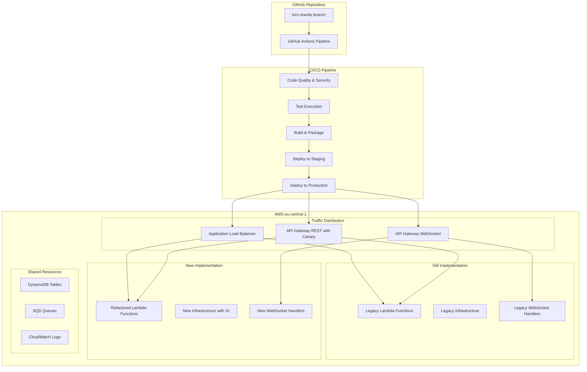

# Design Document

## Overview

This design outlines the implementation of a production-ready deployment pipeline that includes legacy code cleanup, advanced GitHub Actions CI/CD workflows, and deployment to AWS eu-central-1. The solution will establish a robust, secure, and automated deployment process that supports both the existing and refactored implementations running side-by-side.

## Architecture

### High-Level Architecture



### Deployment Strategy

The system will use a **Blue-Green with Connection-Based Routing** deployment strategy:
- Blue: Current production (old implementation)
- Green: New implementation with refactored code
- WebSocket Routing: New connections distributed 50/50, existing connections maintain their implementation
- HTTP/REST Canary: Gradual traffic shifting using weighted routing for non-WebSocket endpoints

## Components and Interfaces

### 1. Legacy Code Cleanup Module

**Purpose**: Identify and remove unused legacy code while maintaining system functionality.

**Components**:
- **Legacy File Scanner**: Analyzes codebase for unused files and dependencies
- **Reference Validator**: Ensures all remaining code references are valid
- **Test Validator**: Verifies all tests pass after cleanup

**Files to Remove**:
- `src/infrastructure/logging/legacy_logging_config.py`
- `src/infrastructure/persistence/legacy_aws_storage.py`
- `src/infrastructure/persistence/legacy_mock_storage.py`
- `src/application/interfaces/storage.py` (replaced by repositories pattern)
- Various test files and summary documents that are no longer needed

### 2. GitHub Actions CI/CD Pipeline

**Purpose**: Automated testing, building, and deployment workflow.

**Pipeline Stages**:

#### Stage 1: Code Quality & Security
- **Linting**: flake8, black, isort
- **Type Checking**: mypy
- **Security Scanning**: bandit, safety
- **Dependency Vulnerability Check**: pip-audit

#### Stage 2: Testing
- **Unit Tests**: pytest with coverage reporting
- **Integration Tests**: AWS service mocking with moto
- **E2E Tests**: Full workflow validation
- **Performance Tests**: Load testing with locust

#### Stage 3: Build & Package
- **Lambda Packaging**: Create deployment packages for each function
- **Docker Building**: Build container images for HTTP/WebSocket servers
- **Terraform Validation**: Validate infrastructure code
- **Artifact Storage**: Upload to GitHub Packages/AWS S3

#### Stage 4: Deployment
- **Staging Deployment**: Deploy to staging environment
- **Production Deployment**: Deploy with canary strategy
- **Health Checks**: Validate deployment success
- **Rollback Capability**: Automatic rollback on failure

### 3. AWS Infrastructure Components

**Purpose**: Production-ready infrastructure in eu-central-1 region.

#### Core Infrastructure
- **API Gateway WebSocket**: Primary endpoint for real-time communication with connection-based routing
- **Application Load Balancer**: Traffic distribution for HTTP endpoints between implementations
- **API Gateway REST**: RESTful API with canary deployment support
- **Lambda Functions**: Serverless compute with the refactored code
- **DynamoDB**: Data persistence layer with connection state management
- **SQS/Step Functions**: Asynchronous processing
- **CloudWatch**: Monitoring and logging with WebSocket connection tracking

#### Traffic Distribution Strategy
- **WebSocket Traffic Distribution**: Primary focus using API Gateway WebSocket with connection-based routing
  - New connections distributed 50/50 between old and new implementations
  - Existing connections maintain their implementation until disconnect
  - Connection routing based on connection ID hashing for consistency
- **ALB Weighted Target Groups**: 50/50 traffic split for HTTP endpoints
- **API Gateway Canary**: Gradual traffic shifting for REST API endpoints
- **Feature Flags**: Runtime control over implementation selection

### 4. Monitoring and Observability

**Purpose**: Comprehensive monitoring of both implementations.

**Components**:
- **CloudWatch Dashboards**: Real-time metrics visualization
- **CloudWatch Alarms**: Automated alerting on anomalies
- **X-Ray Tracing**: Distributed tracing for performance analysis
- **Custom Metrics**: Business and technical KPIs

## Data Models

### Deployment Configuration
```python
@dataclass
class DeploymentConfig:
    region: str = "eu-central-1"
    environment: str  # staging, production
    traffic_split: Dict[str, int]  # {"old": 50, "new": 50}
    feature_flags: Dict[str, bool]
    rollback_threshold: float = 0.05  # 5% error rate
```

### Pipeline State
```python
@dataclass
class PipelineState:
    commit_sha: str
    branch: str = "kiro-rewrite"
    stage: str  # quality, test, build, deploy
    status: str  # running, success, failed
    artifacts: List[str]
    test_results: Dict[str, Any]
```

## Error Handling

### Pipeline Error Handling
- **Stage Failures**: Immediate pipeline termination with detailed reporting
- **Test Failures**: Prevent deployment and provide test reports
- **Deployment Failures**: Automatic rollback to previous version
- **Security Violations**: Block deployment and alert security team

### Runtime Error Handling
- **Health Check Failures**: Automatic traffic rerouting
- **Performance Degradation**: Gradual traffic shift back to stable version
- **Error Rate Thresholds**: Automated rollback triggers

## Testing Strategy

### Test Categories

#### 1. Pre-Deployment Testing
- **Unit Tests**: All layers (domain, application, infrastructure)
- **Integration Tests**: AWS service integrations
- **Contract Tests**: API compatibility between old and new
- **Security Tests**: Vulnerability scanning and penetration testing

#### 2. Post-Deployment Testing
- **Smoke Tests**: Basic functionality validation
- **Health Checks**: Endpoint availability and response time
- **Load Tests**: Performance under expected traffic
- **Chaos Engineering**: Resilience testing

### Test Environments
- **Local**: Developer testing with mocks
- **CI**: Automated testing in GitHub Actions
- **Staging**: Pre-production environment mirroring production
- **Production**: Canary testing with real traffic

### Coverage Requirements
- **Minimum Coverage**: 80% across all modules
- **Critical Path Coverage**: 95% for core business logic
- **Integration Coverage**: 70% for external service interactions

## Security Considerations

### Pipeline Security
- **Secrets Management**: AWS Secrets Manager integration
- **Access Control**: GitHub OIDC with AWS IAM roles
- **Artifact Signing**: Signed deployment packages
- **Audit Logging**: Complete deployment audit trail

### Runtime Security
- **Least Privilege**: Minimal IAM permissions for each service
- **Network Security**: VPC configuration with private subnets
- **Data Encryption**: At-rest and in-transit encryption
- **Compliance**: SOC2 and GDPR compliance measures

## Deployment Phases

### Phase 1: Cleanup and Pipeline Setup (Week 1)
1. Remove legacy code and validate tests
2. Implement GitHub Actions workflows
3. Set up staging environment

### Phase 2: Infrastructure Deployment (Week 2)
1. Deploy new infrastructure to eu-central-1
2. Configure traffic distribution mechanisms
3. Set up monitoring and alerting

### Phase 3: Canary Deployment (Week 3)
1. Deploy new implementation with 0% traffic
2. Gradually increase traffic to 50%
3. Monitor performance and error rates

### Phase 4: Full Production (Week 4)
1. Complete traffic migration if metrics are healthy
2. Decommission old implementation (optional)
3. Optimize and fine-tune performance

## WebSocket Deployment Considerations

### Connection Management Strategy
- **Backend-Enforced Limits**: WebSocket connections automatically close after 2 minutes OR 5 results delivered (whichever comes first)
- **Stateless Architecture**: Results are stored in DynamoDB, connections are ephemeral
- **Simple Routing**: 50/50 distribution of new connections between implementations
- **Result Delivery**: Both implementations can deliver results from shared DynamoDB storage
- **Connection Tracking**: Backend tracks result count and connection time per WebSocket connection
- **No State Migration**: Since connections are short-lived with clear limits, no complex state management needed

### WebSocket-Specific Testing
- **Connection Load Testing**: Simulate high concurrent short-lived WebSocket connections
- **Result Delivery Testing**: Validate real-time result delivery within connection limits
- **Connection Lifecycle Testing**: Test connect -> receive results -> auto-disconnect flow
- **Limit Enforcement Testing**: Verify connections close after 2 minutes OR 5 results
- **Failover Testing**: Validate result delivery works from either implementation
- **Backend Timeout Testing**: Ensure backend properly enforces time and result limits

### Monitoring WebSocket Traffic
- **Connection Metrics**: Track connection creation/destruction rates per implementation
- **Result Delivery Latency**: Monitor time from result storage to WebSocket delivery
- **Connection Success Rate**: Track successful connection establishment and result delivery
- **Limit Enforcement**: Monitor connections closed by time limit (2 min) vs result limit (5 results)
- **Result Distribution**: Track average results delivered per connection
- **Error Rates**: Monitor WebSocket-specific errors and failed result deliveries

## Risk Mitigation

### Technical Risks
- **Deployment Failures**: Automated rollback mechanisms
- **Performance Degradation**: Gradual traffic shifting with monitoring
- **Data Inconsistency**: Shared data layer with careful migration
- **Service Dependencies**: Circuit breakers and retry mechanisms

### Operational Risks
- **Team Knowledge**: Comprehensive documentation and runbooks
- **Monitoring Gaps**: Extensive observability and alerting
- **Security Vulnerabilities**: Automated security scanning and updates
- **Compliance Issues**: Regular compliance audits and reporting