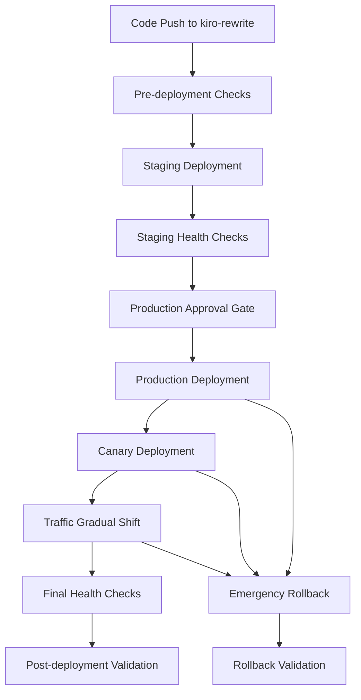

# Deployment Pipeline Guide

This guide provides comprehensive documentation for the WebWunder deployment pipeline, including staging deployment automation, production deployment with approval gates, rollback mechanisms, and health validation.

## Overview

The deployment pipeline is designed to ensure safe, reliable, and automated deployments to both staging and production environments. It includes comprehensive testing, health checks, monitoring, and rollback capabilities.

## Pipeline Architecture



## Deployment Environments

### Staging Environment
- **Purpose**: Pre-production testing and validation
- **Trigger**: Automatic after successful CI/CD pipeline
- **Health Checks**: Comprehensive validation including API, WebSocket, and Lambda functions
- **Rollback**: Manual rollback available

### Production Environment
- **Purpose**: Live production system
- **Trigger**: Manual approval after successful staging deployment
- **Strategy**: Canary deployment with gradual traffic shift (0% → 10% → 25% → 50% → 100%)
- **Health Checks**: Extended monitoring with automatic rollback triggers
- **Rollback**: Automatic rollback on failure, manual rollback available

## Deployment Workflow

### 1. Pre-deployment Checks

The pipeline starts with validation of deployment conditions:

```yaml
# Triggered by successful CI/CD workflows
on:
  workflow_run:
    workflows: ["Code Quality and Security", "Comprehensive Testing", "Build and Package"]
    types: [completed]
    branches: [kiro-rewrite]
```

**Validation Steps:**
- Verify all prerequisite workflows completed successfully
- Download and validate build artifacts
- Check artifact integrity and completeness

### 2. Staging Deployment

Automatic deployment to staging environment:

**Infrastructure Deployment:**
- Deploy Lambda functions with latest code
- Update infrastructure using Terraform
- Configure API Gateway and WebSocket endpoints
- Update container images if applicable

**Health Validation:**
- Comprehensive health checks using `scripts/health-check.py`
- API endpoint validation
- WebSocket connectivity testing
- Lambda function state verification
- Error rate monitoring

**Smoke Tests:**
- End-to-end workflow validation
- Basic functionality testing
- Performance baseline establishment

### 3. Production Approval Gate

Manual approval required for production deployment:

**Approval Requirements:**
- Staging deployment must be successful
- All health checks must pass
- Manual approval from authorized personnel
- Production deployment checklist review

**Approval Process:**
1. System generates production deployment checklist
2. Authorized personnel review deployment details
3. Manual approval triggers production deployment
4. Approval timeout: 1 hour (configurable)

### 4. Production Deployment

Canary deployment strategy with gradual traffic shift:

**Phase 1: Initial Deployment (0% traffic)**
- Deploy new Lambda function versions
- Create canary aliases
- Update infrastructure with canary configuration
- Initial health checks on new version

**Phase 2: Gradual Traffic Shift**
- Traffic phases: 10% → 25% → 50% → 100%
- 5-minute monitoring between phases
- Automatic rollback if error thresholds exceeded
- Real-time health monitoring

**Phase 3: Final Validation**
- Comprehensive health checks
- Performance validation
- Error rate analysis
- Cleanup of canary deployment artifacts

### 5. Post-deployment Validation

Extended validation and monitoring:

**Validation Tests:**
- Comprehensive deployment validation using `scripts/deployment-validator.py`
- API endpoint functional testing
- WebSocket connectivity and message flow testing
- Lambda function integration testing
- Data persistence validation
- Load testing (optional)

**Monitoring:**
- 10-minute continuous monitoring using `scripts/deployment-monitor.py`
- Real-time metrics collection
- Alert generation for anomalies
- Performance trend analysis

## Rollback Mechanisms

### Automatic Rollback

Triggered automatically when:
- Error rate exceeds 5% threshold
- Response time exceeds 10 seconds
- Health checks fail
- Consecutive failures exceed threshold

**Automatic Rollback Process:**
1. Detect failure condition
2. Immediately stop traffic shift
3. Revert Lambda aliases to previous versions
4. Remove API Gateway canary settings
5. Validate rollback success
6. Generate rollback report

### Manual Rollback

Available through workflow dispatch:

```bash
# Trigger manual rollback
gh workflow run deployment.yml \
  -f environment=production \
  -f rollback_version=<version_number>
```

**Manual Rollback Features:**
- Rollback to specific version
- Comprehensive rollback validation
- Backup creation before rollback
- Detailed rollback reporting

### Emergency Rollback

Automatic emergency rollback on deployment failure:

**Triggers:**
- Production deployment job failure
- Critical health check failures
- Infrastructure deployment errors

**Process:**
1. Download production backup
2. Restore Lambda function versions
3. Remove canary deployments
4. Validate rollback health
5. Generate emergency rollback report

## Health Checks and Validation

### Health Check Categories

**1. Lambda Function Health**
- Function state verification
- Configuration validation
- Invocation testing
- Error rate monitoring

**2. API Gateway Health**
- Endpoint availability
- Response time validation
- Error rate monitoring
- Integration testing

**3. WebSocket Health**
- Connection establishment
- Message flow testing
- Connection limit validation
- Real-time communication testing

**4. Data Persistence Health**
- DynamoDB table status
- Read/write operations
- Data consistency validation

### Health Check Thresholds

```yaml
# Staging thresholds
staging:
  max_error_rate: 10%
  max_response_time: 5000ms
  min_success_rate: 95%

# Production thresholds
production:
  max_error_rate: 5%
  max_response_time: 3000ms
  min_success_rate: 98%
```

### Validation Scripts

**Health Check Script:**
```bash
python scripts/health-check.py production \
  --region eu-central-1 \
  --api-endpoint https://api.webwunder.com \
  --ws-endpoint wss://ws.webwunder.com \
  --output health-results.json
```

**Deployment Validator:**
```bash
python scripts/deployment-validator.py production \
  --region eu-central-1 \
  --api-url https://api.webwunder.com \
  --ws-url wss://ws.webwunder.com \
  --include-load-test \
  --output validation-results.json
```

**Deployment Monitor:**
```bash
python scripts/deployment-monitor.py production \
  --region eu-central-1 \
  --duration 600 \
  --interval 60 \
  --output monitoring-results.json
```

## Configuration

### Deployment Configuration

Configuration is managed through `.github/deployment-config.yml`:

```yaml
deployment:
  production:
    canary:
      enabled: true
      traffic_phases: [0, 10, 25, 50, 100]
      phase_duration: 300
      rollback_triggers:
        error_rate_threshold: 5.0
        response_time_threshold: 10000
```

### Environment Variables

Required environment variables:

```bash
AWS_REGION=eu-central-1
PYTHON_VERSION=3.11
TERRAFORM_VERSION=1.5.0
```

### Secrets

Required GitHub secrets:

- `AWS_STAGING_ROLE_ARN`: IAM role for staging deployments
- `AWS_PRODUCTION_ROLE_ARN`: IAM role for production deployments

## Monitoring and Alerting

### Metrics Collected

**Lambda Metrics:**
- Invocations
- Errors
- Duration
- Memory utilization
- Concurrent executions

**API Gateway Metrics:**
- Request count
- Latency
- 4XX/5XX errors
- Integration latency

**Custom Metrics:**
- WebSocket connections
- Search requests
- Results delivered
- Connection limits reached

### Alert Thresholds

**Critical Alerts:**
- Error rate > 10%
- Response time > 5000ms
- Availability < 95%

**Warning Alerts:**
- Error rate > 5%
- Response time > 3000ms
- Availability < 98%

### Notification Channels

- Slack: `#deployments` (success), `#alerts` (failures)
- Email: DevOps team for approvals, On-call for critical issues
- Webhooks: Integration with external monitoring systems

## Security and Compliance

### Security Checks

Required security validations:
- Dependency vulnerability scanning
- Static code analysis
- Secrets detection
- Infrastructure compliance

### Access Control

- GitHub OIDC integration with AWS IAM
- Least privilege permissions
- Audit logging for all deployment actions
- Multi-factor authentication for production approvals

### Compliance

- GDPR compliance validation
- SOC2 requirements
- AWS security best practices
- Data encryption at rest and in transit

## Troubleshooting

### Common Issues

**1. Staging Deployment Failures**
- Check artifact integrity
- Verify AWS permissions
- Review Terraform state
- Check Lambda function logs

**2. Production Approval Timeouts**
- Verify approval requirements
- Check notification delivery
- Review approval permissions
- Manual approval through GitHub UI

**3. Canary Deployment Issues**
- Monitor traffic distribution
- Check Lambda alias configuration
- Verify API Gateway canary settings
- Review CloudWatch metrics

**4. Rollback Failures**
- Check backup availability
- Verify rollback permissions
- Review Lambda version history
- Manual intervention may be required

### Debugging Commands

```bash
# Check deployment status
gh run list --workflow=deployment.yml

# View deployment logs
gh run view <run_id> --log

# Check AWS resources
aws lambda list-functions --region eu-central-1
aws apigateway get-rest-apis --region eu-central-1

# Manual health check
python scripts/health-check.py production --region eu-central-1

# Manual rollback
python scripts/rollback.py production --target-version <version>
```

### Log Locations

- **GitHub Actions**: Workflow run logs
- **CloudWatch**: `/aws/lambda/webwunder-{env}-{function}`
- **Terraform**: State files and plan outputs
- **Health Checks**: Artifact uploads in GitHub

## Best Practices

### Deployment Best Practices

1. **Always deploy to staging first**
2. **Wait for health checks to pass**
3. **Monitor metrics during deployment**
4. **Have rollback plan ready**
5. **Communicate deployment status**

### Monitoring Best Practices

1. **Set appropriate alert thresholds**
2. **Monitor business metrics, not just technical**
3. **Use multiple monitoring approaches**
4. **Automate response to common issues**
5. **Regular review of monitoring effectiveness**

### Security Best Practices

1. **Use least privilege permissions**
2. **Rotate secrets regularly**
3. **Audit all deployment actions**
4. **Encrypt sensitive data**
5. **Regular security reviews**

## Maintenance

### Regular Tasks

- Review and update deployment thresholds
- Clean up old deployment artifacts
- Update security configurations
- Review and improve monitoring
- Test rollback procedures

### Quarterly Reviews

- Deployment pipeline performance analysis
- Security audit and updates
- Monitoring effectiveness review
- Process improvement identification
- Documentation updates

## Support

For deployment pipeline issues:

1. **Check this documentation first**
2. **Review GitHub Actions logs**
3. **Check AWS CloudWatch logs**
4. **Contact DevOps team**
5. **Create incident ticket for critical issues**

## References

- [GitHub Actions Documentation](https://docs.github.com/en/actions)
- [AWS Lambda Deployment Best Practices](https://docs.aws.amazon.com/lambda/latest/dg/best-practices.html)
- [Terraform AWS Provider](https://registry.terraform.io/providers/hashicorp/aws/latest/docs)
- [WebWunder Architecture Documentation](./ARCHITECTURE.md)